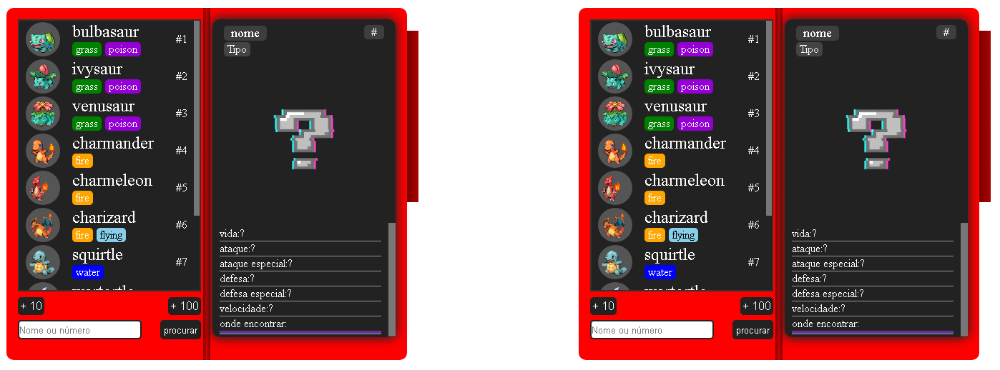

<h1 align="center">COMPARE COKÉDEX</h1>

<h2 align="center" style="box-shadow: -5px 5px #333;">Projeto criado para fins de estudo usando a API <a href="https://pokeapi.co">PokéAPI</a></h2>

 

## o que faz?

Compare um Pokémon com outro e veja qual é mais forte, você pode procurar pelo nome do Pokémon ou o id dele. NÃO é um mini-game, todos os dados são usados para demonstração de estatisticas dos Pokémons.

 

## demonstração:

Primeira tela

 

Tela de comparação

 

<h2 align="center" style="color:red; font-size: 2.5rem;">ATENÇÃO</h2>

Todas as imagens dos Pokémons são retiradas da API
